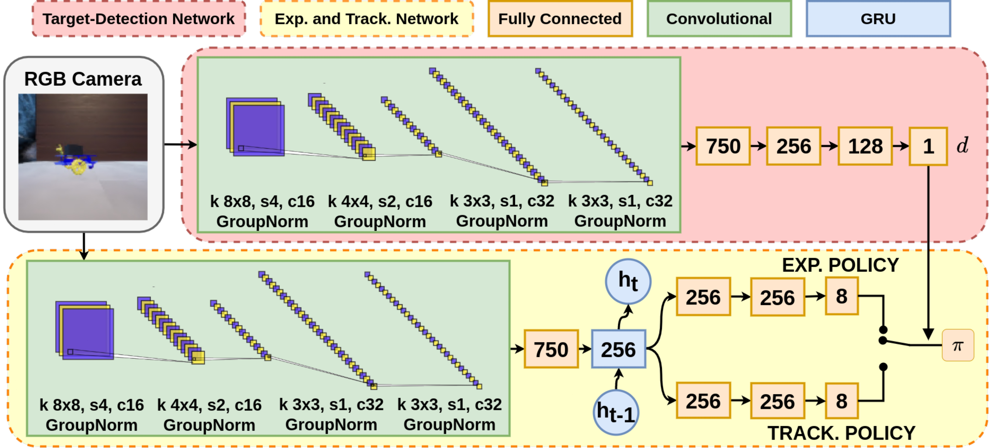
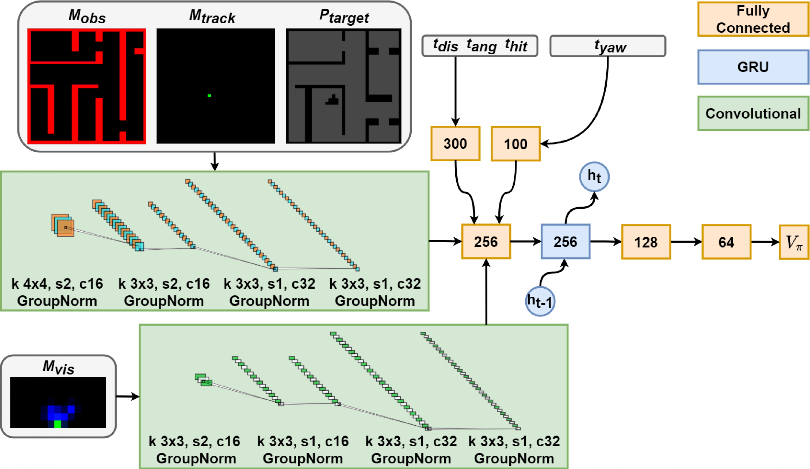

# E-VAT: an Asymmetric End-to-End Approach to Visual Active Exploration and Tracking

This repository is the official implementation of [E-VAT: an Asymmetric End-to-End Approach to Visual Active
Exploration and Tracking](https://ieeexplore.ieee.org/document/9712363). 

## Description
The development of visual tracking systems is becoming
a major goal for the Robotics community. Most of the works
dealing with this topic focus exclusively on passive tracking, where
the target is confined within the camera’s field of view.
Only a minority propose active approaches, but all the methods
introduced so far assume that the target is initially in the immediate
proximity of the tracker. This represents an undesirable constraint
on the applicability of these techniques.
Thus, we propose a novel End-to-End Deep Reinforcement
Learning based system, capable of both exploring the surrounding
environment to find the target and then of tracking it. To do this,
we develop a network consisting of two subcomponents: i) the
Target-Detection Network, which detects the target in the camera’s
field-of-view, and ii) the Exploration and Tracking Network, which
employs this information to switch between the exploration policy
and the tracking policy with the goal of exploring the environment,
finding the target and finally tracking it.
<br/><br/>

<figure>
  <figcaption align = "center"><b>Actor Net</b></figcaption>
  
</figure>
<br/>

## Requirements

To install [requirements](./requirements.txt):

```setup
pip install -r requirements.txt
```

You will also need two others additional libraries:

- ```remind```: implementation of a replay buffer.
    ```setup
    cd isarlab_libraries\remind   
    pip install -e .
    ```
- ```isarsocket```: sockets used to exchange data between threads.
    ```setup
    cd isarlab_libraries\isarsocket   
    pip install -e .
    ```

## Files

    main.py

    my_agent.py

    model_1CA.py

    learner.py

    IMPALA.py

    utils.py

    models

        └── two_tails_1CA.pt


- [main.py](./main.py): main file that instantiates the different threads. Hyperparameter values are set in this file.
- [my_agent.py](./my_agent.py): implementation of an E-VAT agent (mp.Process). 
- [learner.py](./learner.py): centralized learner (mp.Process).
- [IMPALA.py](./IMPALA.py): implementation of [IMPALA: Scalable Distributed Deep-RL with Importance Weighted Actor-Learner Architecture](https://arxiv.org/abs/1802.01561).
- [utils.py](./utils.py): contains useful functions.
- [models](./models): folder containing pretrained models.

## Usage

After setting the hyperparameters:

```setup
python main.py
```

In order for the framework to work, you need to create your own OpenAI Gym and import it into the [utils.py](/utils.py) file.
The Gym sends data to E-VAT agents and must implement two main methods.
>
>- ```step(action)```: takes an action from the agent and returns a tuple ```<state, done, info, reward>```.
>
>
>- ```reset()```: reset the environment and returns a tuple ```<state, info>```.
 
Actions, states, done, info and rewards are defined as follows: 

>- ```action```: action taken by the agent.
>  - type: *numpy.ndarray*
>  - shape: *()*  
>  - values: *integer ∈ [0, number of actions]*
>  
>
>- ```state```: E-VAT [actor input](./doc/images/actorNet.jpg). First Person View RGB image.
>  - type: *numpy.ndarray* 
>  - shape: *(84, 84, 3)*
>  - values: *real ∈ [0.0, 1.0]*
>
>  
>- ```done```: signal used to interrupt an episode.
>  - type: *boolean*
>
>  
>- ```reward```: reward as defined in the paper.
>  - type: *numpy.ndarray*
>  - shape: *(1,)*
>  - values: *real*
>
>
>- ```info```: dictionary containing E-VAT [critic inputs](./doc/images/criticNet.jpg):  

>  - ```Geo_target```: 35 x 35 3D grid (Obstacle Map, Tracker Position and Target Probability Map).
>    - type: *numpy.ndarray*
>    - shape: *(3, 35, 35)*
>    - values: *real ∈ [0.0, 1.0]*
> 
>  - ```Ego_target```: 21 x 11 3D grid representing the egocentric FoV of the tracker. 
>    - type: *numpy.ndarray*
>    - shape: *(3, 11, 21)*
>    - values: *real ∈ [0.0, 1.0]*
> 
>  - ```Tracker_position```: coordinates of the tracker within the 35 x 35 grid.
>    - type: *numpy.ndarray*
>    - shape: *(1, 2)*
>    - values: *integer ∈ [0, 34]*
> 
>  - ```angle```: orientation [deg] with respect to the target.
>    - type: *numpy.ndarray*
>    - shape: *()*
>    - values: *real ∈ [-180, +180]*
> 
>  - ```distance```: distance from the target.
>    - type: *numpy.ndarray*
>    - shape: *()*
>    - values: *real*
> 
>  - ```hit```: 1 if the target is within the tracker FoV, 0 otherwise.
>    - type: *numpy.ndarray*
>    - shape: *()*
>    - values: *integer ∈ [0, 1]*
> 
>  - ```GPS_Yaw```: tracker’s orientation [deg] with respect to the global frame.
>    - type: *numpy.ndarray*
>    - shape: *()*
>    - values: *real ∈ [-180, +180]*

<br/><br/>
<figure>
  <figcaption align = "center"><b>Critic Net</b></figcaption>
  
</figure>
<br/>

## Citing

If you use this framework in a scientific context, please cite the following:

> A. Dionigi, A. Devo, L. Guiducci and G. Costante, *"E-VAT: An Asymmetric End-to-End Approach to Visual Active 
> Exploration and Tracking"* in IEEE Robotics and Automation Letters, vol. 7, no. 2, pp. 4259-4266, April 2022, 
> DOI: [10.1109/LRA.2022.3150866](/https://ieeexplore.ieee.org/document/9712363).

BibTeX details:

```bibtex
@Article{dionigi2022vat,  
  title     = {E-VAT: An Asymmetric End-to-End Approach to Visual Active Exploration and Tracking},
  author    = {Dionigi, Alberto and Devo, Alessandro and Guiducci, Leonardo and Costante, Gabriele},
  journal   = {IEEE Robotics and Automation Letters},
  volume    = {7},
  number    = {2},
  pages     = {4259--4266},
  year      = {2022},
  publisher = {IEEE}
}
```
